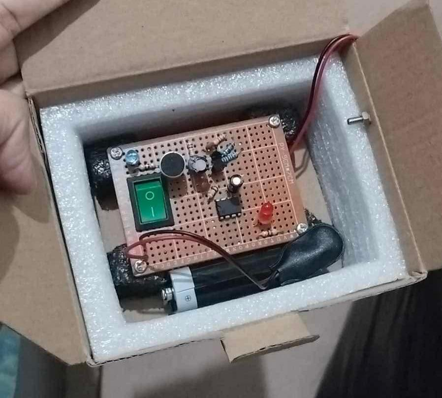

# Sound-Activated Alarm 

## 📖 Introduction
The **Sound-Activated Alarm** (also known as a Clap Switch) is a purely hardware-based, analog circuit. It detects sharp acoustic sounds—like a hand clap or a finger snap—and triggers a temporary visual (LED) and auditory (Buzzer) response. Built completely without microcontrollers or code, this project demonstrates fundamental electronics principles, relying entirely on physical hardware logic and the highly versatile 555 Timer IC operating in monostable mode.

## 📸 Prototype

   
  <em>Figure 1: The assembled Sound-Activated Alarm circuit on a perfboard.</em>

  <strong><a href="https://drive.google.com/file/d/1WMeFowAYiHC41WY0iwr-La1uSUPXraAw/view?usp=sharing">View Full Project Documentation Here</a></strong>

## 🛠️ Materials Required

Here is the complete Bill of Materials (BOM) needed to build this circuit:

| Component | Description / Details | Quantity |
| :--- | :--- | :---: |
| **555 Timer IC** | NE555 (Monostable Timer) | 1 |
| **Microphone** | Electret Condenser Mic (Sound Sensor) | 1 |
| **Transistors** | NPN Transistors (e.g., BC547 or 2N3904) | 2 |
| **Resistors** | Used for timing and biasing | 3 |
| **Capacitors** | Electrolytic capacitors for timer delay | 2 |
| **LEDs** | 1x Power Indicator, 1x Output (Red) | 2 |
| **Buzzer** | Active 5V Audio Buzzer | 1 |
| **Switch** | Green Rocker Switch (Main Power Toggle) | 1 |
| **Power Supply** | 5V Battery Source | 1 |
| **Board** | Perfboard / Prototyping Board | 1 |

## 🔌 Point-to-Point Wiring Guide

Since this project is built on a perfboard without a printed circuit board (PCB), the following table maps out exactly how the components connect to one another. This serves as a text-based schematic to help you recreate or troubleshoot the circuit.

### 1. Power & Ground (The Backbone)
| Component | Pin / Terminal | Connected To |
| :--- | :--- | :--- |
| **Battery (5V)** | Positive (+) | Main Power Switch |
| **Battery (5V)** | Negative (-) | Common Ground Rail |
| **Main Switch** | Input | Battery Positive (+) |
| **Main Switch** | Output | Main VCC Rail (Powers the rest of the circuit) |
| **Power LED** | Anode (+) | VCC Rail (via a current-limiting resistor) |
| **Power LED** | Cathode (-) | Common Ground Rail |

### 2. Microphone & Amplifier Stage
| Component | Pin / Terminal | Connected To |
| :--- | :--- | :--- |
| **Microphone** | Negative (-) Pin | Common Ground Rail |
| **Microphone** | Positive (+) Pin | VCC (via a resistor) AND Transistor 1 Base (via a capacitor) |
| **Transistors (Both)**| Emitter Pins | Common Ground Rail |
| **Transistor 1** | Collector Pin | Transistor 2 Base |
| **Transistor 2** | Collector Pin | 555 Timer IC - **Pin 2 (Trigger)** |

### 3. The 555 Timer IC (Brain)
| 555 Timer Pin | Name | Connected To | Purpose |
| :---: | :--- | :--- | :--- |
| **1** | Ground | Common Ground Rail | Completes the power circuit for the IC. |
| **2** | Trigger | Transistor 2 Collector | Receives the amplified signal when a sound is detected. |
| **3** | Output | Red LED (+) and Buzzer (+) | Sends power to the alarms when triggered. |
| **4** | Reset | VCC Rail | Kept high to prevent the timer from resetting randomly. |
| **5** | Control | Unconnected | (Optional) Can connect to ground via a small capacitor to reduce noise. |
| **6** | Threshold | Pin 7 & Timing Capacitor (+) | Monitors the capacitor voltage to know when to turn off. |
| **7** | Discharge | Pin 6 & Timing Resistor | Discharges the timing capacitor when the cycle ends. |
| **8** | VCC | VCC Rail | Main power input for the IC. |

### 4. Output Stage (Alarms)
| Component | Pin / Terminal | Connected To |
| :--- | :--- | :--- |
| **Red LED** | Anode (+) | 555 Timer - **Pin 3 (Output)** |
| **Red LED** | Cathode (-) | Common Ground Rail |
| **Buzzer** | Positive (+) | 555 Timer - **Pin 3 (Output)** |
| **Buzzer** | Negative (-) | Common Ground Rail |

> **Note on Timing:** The duration the LED and Buzzer stay on is controlled by the values of the **Timing Resistor** (connected between VCC and Pin 7) and the **Timing Capacitor** (connected between Pin 6 and Ground). Changing these components will increase or decrease the alarm time!

## ⚙️ How It Works

This circuit is an excellent example of analog signal processing and operates in four main stages:

1. **Detection:** When a sharp sound is produced, the acoustic waves strike the Electret Condenser Microphone. The microphone converts this physical acoustic energy into a very small electrical voltage spike.
2. **Amplification:** Because the raw voltage from the microphone is too weak to trigger the timer chip directly, the signal passes through the two NPN transistors. These components act as a high-gain audio amplifier, taking the weak input and boosting it into a sharp, strong electrical pulse.
3. **Signal Processing (The Brain):** The newly amplified pulse is sent to the "Trigger" pin (Pin 2) of the 555 Timer IC. In this circuit, the 555 Timer is wired as a **Monostable Multivibrator** (a "one-shot" timer). When triggered, its output (Pin 3) switches to a "HIGH" state (providing power) for a specific duration. This duration is strictly dictated by the physical values of the capacitors and resistors connected to the IC.
4. **Output:** While the 555 Timer's output is HIGH, power flows out to the Red LED and the Buzzer simultaneously, causing them to activate. Once the timing cycle completes, the output drops back to "LOW," silencing the buzzer and turning off the LED until the next sound triggers the circuit.
